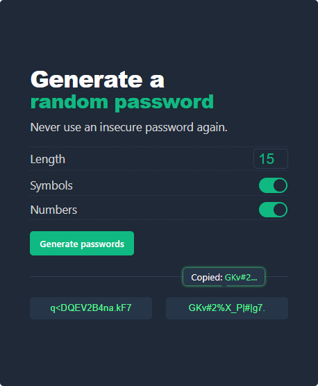

# 🔐 Password Generator App

A modern, secure, and easy-to-use password generator built with pure Vanilla JavaScript.

Effortlessly create highly secure, customized passwords and copy them with a single click.

---

## 🔗 Live Demo

[**Try the Password Generator App here!**](https://password-generator-golden.netlify.app/).

---

---

## ✨ Features

- **Customizable Length:** Easily adjust the password length up to your desired size using the input field (default is 15).
- **Toggle Options:** Include or exclude **Symbols** and **Numbers** to meet various security requirements using custom-built toggle switches.
- **Instant Generation:** Generates two unique, secure passwords simultaneously on click.
- **Zero-Click Copy:** Clicking the generated password field instantly copies the text to the clipboard.
- **Visual Feedback:** Provides clear visual confirmation (green box-shadow and tooltip text) upon successful copying.

---

## 🛠️ Technologies Used

| Technology             | Purpose                                                   |
| :--------------------- | :-------------------------------------------------------- |
| **HTML5**              | Structure and Semantic Layout                             |
| **CSS3**               | Styling, Layout (`flexbox`), and Toggle Switch mechanism  |
| **Vanilla JavaScript** | Logic, DOM Manipulation, Randomization, and Clipboard API |

---

## 🚀 Getting Started

Follow these steps to get a local copy of the project up and running.

### Prerequisites

You need a modern web browser to run the application (Chrome, Firefox, Safari, etc.).

### Installation

1.  **Clone the Repository:**
2.  **Navigate to the Project Directory:**
3.  **Open the Application:**
    Simply open the `index.html` file in your preferred web browser.

---

## 📝 Usage

1.  **Set Length:** Adjust the number in the **Length** input field.
2.  **Select Character Sets:** Use the **toggle switches** to include/exclude Symbols or Numbers.
3.  **Generate:** Click the **`Generate passwords`** button.
4.  **Copy:** Click on either of the displayed password fields. The password will be **copied to your clipboard**, and a brief tooltip will confirm the action.

---

## ⚙️ Logic Highlights

The core functionality is handled in `index.js`:

- **Character Filtering:** The `generatePasswords` function dynamically updates the `charsCollection` based on the state of the Symbols and Numbers toggles, using the powerful `.filter()` array method.
- **Clipboard API:** The `copyPassword` function prioritizes the modern `navigator.clipboard.writeText()` for seamless, secure copying and includes a `document.execCommand('copy')` fallback for broader compatibility.
